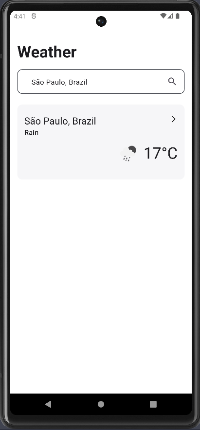
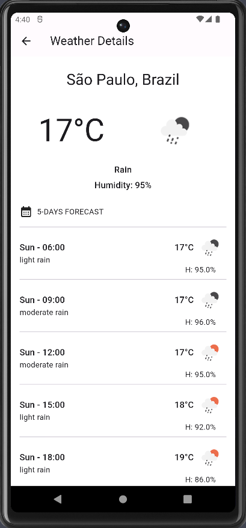

# CloudWalk Weather Test

## Prerequisites

- This project support `3.16.9` flutter version
- [Flutter](https://docs.flutter.dev/get-started/install)

### Weather retrieval

You can create a [free account](https://home.openweathermap.org/users/sign_up) and get
your [API key](https://home.openweathermap.org/api_keys).

API documentation:

- https://openweathermap.org/current
- https://openweathermap.org/forecast

## Getting Started

1 - Clone project

```sh
    git clone https://github.com/luisgmarini/cloudwalk_test.git
```

2 - Get dependencies

```sh
    flutter pub get
```

3 - Add your Weather API key on `Environment.initialize` method, localized in `lib/main.dart`, You
can create a [free account](https://home.openweathermap.org/users/sign_up) and get
your [API key](https://home.openweathermap.org/api_keys).

```sh
  Environment.initialize(
      apiKey: '', // Add here your Weather API key
  ); 
```

4 - Run App

```sh
    flutter run
```

## Tools & Technologies

- [Tuya SDK Plugin](https://git.paytvlabs.com.br/iot-br/tuya_sdk_plugin)
- [Flutter Bloc](https://pub.dev/packages/flutter_bloc)
- [Mocktail](https://pub.dev/packages/mocktail)
- [Intl](https://pub.dev/packages/intl)
- [Dio](https://pub.dev/packages/dio)
- [Equatable](https://pub.dev/packages/equatable)

## Preview

 | 

